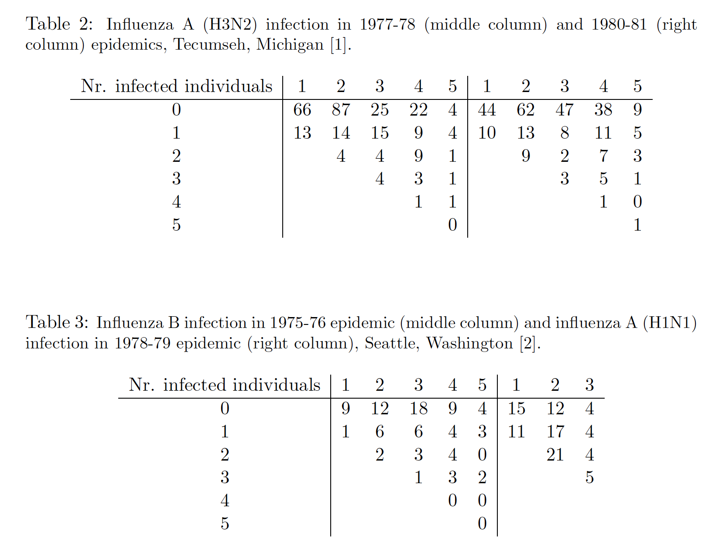

```{r setup, include=FALSE}
library(knitr)
opts_chunk$set(echo = TRUE, warning = FALSE)
```

#1. Introduction
The challenge is to find whether influenza spreads between household members and community members at different rates for different strains of the disease. Data is gathered of two different outbreaks of the same strain (1977 and 1980). Data is also gathered of the outbreaks of two different strains in the same location. Using Approximate Bayesian Computation, we attempt to estimate the rate of infection within household and and within communities for each of the four data sets. We compare those estimated rates for the two examples of the same strain. Then we compare the two examples of different strains.


#2. Step for Creating Data
We manually create data matrices based on Table 2 and Table 3 in the paper. Figure 1 represents these tables. The columns are the number of people in the household who are conisdered susceptable to the flu. The rows are the number of people in that household who got the flu. For example, in the 1977 Flu A outbreak, there were 79 households with one susceptible person, and out of those, 66 households had no infections adn 13 had one infection. With this data, the column proportions are used as the observed dataset in Approximate Bayesian Computation.




```{r creating data}
#the observed data A77
data_raw_matrix = matrix(c(66, 87, 25, 22, 4,
                           13, 14, 15, 9, 4,
                           0, 4, 4, 9, 1,
                           0, 0, 4, 3, 1,
                           0, 0, 0, 1, 1,
                           0, 0, 0, 0, 0), ncol = 5, byrow = TRUE)
data_A77 = prop.table(data_raw_matrix,2)

#the observed data A80
data_raw_matrix = matrix(c(44, 62, 47, 38, 9,
                          10, 13, 8, 11, 5,
                           0, 9, 2, 7, 3,
                           0, 0, 3, 5, 1,
                           0, 0, 0, 1, 0,
                           0, 0, 0, 0, 1), ncol = 5, byrow = TRUE)
data_A80 = prop.table(data_raw_matrix,2)

#the observed data ASE
data_raw_matrix = matrix(c(15, 12, 4,
                          11, 17, 4,
                           0, 21, 4,
                           0, 0, 5), ncol = 3, byrow = TRUE)
data_ASE = prop.table(data_raw_matrix,2)

#the observed data BSE
data_raw_matrix = matrix(c(9, 12, 18, 9, 4,
                          1, 6, 6, 4, 3,
                           0, 2, 3, 4, 0,
                           0, 0, 1, 3, 2,
                           0, 0, 0, 0, 0,
                           0, 0, 0, 0, 0), ncol = 5, byrow = TRUE)
data_BSE = prop.table(data_raw_matrix,2)
```


#3. Step for Approximate Bayesian Computation

Now, we are ready for Approximate Bayesian Computation. In the paper, the writers made distinction of infections between spread inside housegolds and across the population at large. $q_c$ indicates the probability that a susceptible individual was not infected from the community. On the other hand, $q_h$ denotes the probability that susceptible individual escapes infection within their household. These probabilities, $q_c$ and $q_h$ will be our parameters for the model. As the author of the paper suggested we create our initial parameters from unifrom distribution over the range [0,1] and then update these by perturbation kernel using Gaussian distribution through iterations. Since we have our values of parameters from its prior distribution, data generating function given the parameters can be created. The data generating function that represents the probability that j out of the s susceptibles in a household get infected is following:

$$
\begin{aligned}
&w_{js} = \binom{s}{j} w_{jj}(q_c q^j_h)^{s-j},\\
&where \quad w_{0s}=q^s_c,\quad s=0,1,2,..., \ and \quad w_{jj}=1-\sum_{i=0}^{j-1}w_{ij}
\end{aligned}
$$

To decide whether we will accept the generated data comparing with the obeserved data, squared Euclidean distances are applied as a summary statistic. In other words, only if squared Euclidean distance between the generated data and the observed data is smaller than a tolerance $\epsilon$, we accepted those $q_c$ and $q_h$ as a sample from the posterior distribution. We repeat this procedure 1,000 times to create 1,000 samples of the posteior distribtion with different values of the tollerance $\epsilon$.


```{r ABC step}
#the data generating function
generate_probabilities = function(theta, n_col_data = 5)
{
	q_c = theta[1]
	q_h = theta[2]
	w_0 = sapply(seq(1, n_col_data, by = 1), function(x){return(`^`(q_c,x))}) #w_0s components (1st row components)
	prob_matrix = matrix(rep(0, n_col_data^2), nrow = n_col_data)
	
	for (i in 1 : (n_col_data - 1)){
		prob_matrix[i, i] = 1 - w_0[i] - sum(prob_matrix[1:i, i]) #w_jj components (diagonal components)
		for (j in (i+1):n_col_data)
		{
			prob_matrix[i, j] = choose(j,i) * prob_matrix[i,i] * (q_c * q_h^i)^(j-i) #w_js components
		}
	}
	prob_matrix[n_col_data, n_col_data] = 1 - w_0[n_col_data] - sum(prob_matrix[1:n_col_data, n_col_data]) #last elements of the matrix
	probabilities = rbind(w_0, prob_matrix) #W matrix (data matrix)
	return(probabilities)
}

#generate the first abc sample
generate_abc_sample_1 = function(observed_data, data_generating_function, epsilon)
{
	while(TRUE)
	{
		q_c_h = runif(2) #q_c and q_h
		generated_data = data_generating_function(theta = q_c_h)
		if(sum((generated_data - observed_data)^2) < epsilon^2) #Squared Euclidean distance
			return(q_c_h)
	}
}

#generate the sequential abc sample
generate_abc_sample_2 = function(observed_data, population, data_generating_function, epsilon)
{
	while(TRUE)
	{
	  N_sample = dim(population)[2]
		sample_index = floor(runif(1, min = 1, max = N_sample + 0.999))
		q_c_h = population[ , sample_index] #population = previous posterior_sample
		q_c_h[1] = rnorm(1, mean = q_c_h[1], sd = 0.05) #perturbation kernel using Gaussian dist
		q_c_h[2] = rnorm(1, mean = q_c_h[2], sd = 0.05) #perturbation kernel using Gaussian dist
		generated_data = data_generating_function(theta = q_c_h)
		if(sum((generated_data - observed_data)^2) < epsilon^2) #Squared Euclidean distance
			return(q_c_h)
	}
}


#the main function
generate_abc_smc_sample = function(dataset)
{
	generate_prob = function(theta){generate_probabilities(theta, n_col_data = ncol(dataset))}
	epsilon_vector = seq(1, 0.35, by = -0.05) #try different epsilons to find minimum point of converging
	n_sequential = length(epsilon_vector)
	N_sample = 1000
	for (i in 1:n_sequential)
	{
		if (i == 1)
		{
			posterior_sample = replicate(generate_abc_sample_1(observed_data = dataset,
															   data_generating_function = generate_prob,
															   epsilon = epsilon_vector[i]), n = N_sample)
		}
		else
		{
			posterior_sample = replicate(generate_abc_sample_2(observed_data = dataset,
										population = posterior_sample,
										data_generating_function = generate_prob,
										epsilon = epsilon_vector[i]), n = N_sample)
		}
		#print(i) #to check the number of iteration to find the best epsilon
	}
	return(posterior_sample)
}
```


#4. Conclusion
```{r conclusion}
posterior_sample_A77 = generate_abc_smc_sample(data_A77)
posterior_sample_A80 = generate_abc_smc_sample(data_A80)
posterior_sample_ASE = generate_abc_smc_sample(data_ASE)
posterior_sample_BSE = generate_abc_smc_sample(data_BSE)

par(mfrow=c(1,2))
plot(x =posterior_sample_A77[2, ], y = posterior_sample_A77[1, ], type = "p", col = "red", xlim = c(0,1), ylim = c(0,1), xlab = "q_h", ylab = "q_c", main="Table 1")
points(x = posterior_sample_A80[2, ], y = posterior_sample_A80[1, ], type = "p", col = "blue", xlim = c(0,1), ylim = c(0,1))

plot(x = posterior_sample_ASE[2, ], y = posterior_sample_ASE[1, ], type = "p", col = "blue", xlim = c(0,1), ylim = c(0,1), xlab = "q_h", ylab = "q_c", main="Table 2")
points(x = posterior_sample_BSE[2, ], y = posterior_sample_BSE[1, ], type = "p", col = "red", xlim = c(0,1), ylim = c(0,1))
par(mfrow=c(1,1))
```

The graphs above stand for the marginal posteior distibutions of the prameters after ABC. The first graph is from Table 1 and the second one is from Table 2 of the figure 1. The first graph indicates that the two outbreaks of the same strain spread with approximately the same probabilities.(The marginal posterior distributions mostly overlap.) Our second graph shows that different strains spread with different probabilities. (The marginal posterior distributions are very different.)


